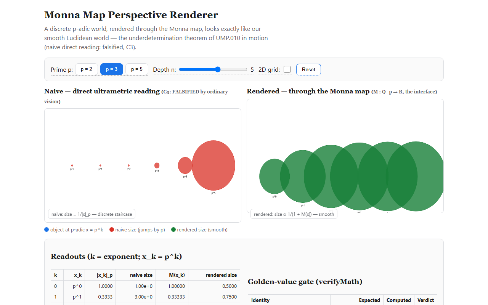
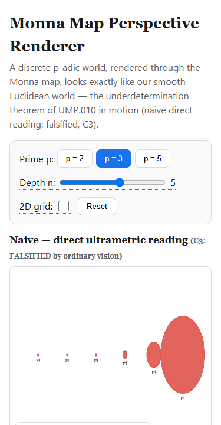

# Monna Map Perspective Renderer

**Status:** LIVE — deployed 2026-08-16
**URL:** https://qnfo.github.io/qwav-demo-monna-map-perspective/
**Source:** `QNFO/qwav-demos:monna-map-perspective/` (this folder)

## What This Shows

The C5 worked demo of *Non-Archimedean Projective Perspective* (QNFO.UMP.010,
10.5281/zenodo.21969784). A discrete p-adic scene — objects at positions x = p^k
along the line of sight — is rendered two ways:

1. **Naive (direct ultrametric reading)** — apparent size = 1/|x|_p = p^k: a
   staircase whose sizes jump by a factor of p. This is hypothesis **C3, which
   ordinary vision FALSIFIES** (real perspective is smooth).
2. **Rendered (through the Monna map)** — the interface M: Q_p → R (digit-wise:
   M(Σ a_k p^k) = Σ a_k p^−k) converts the same p-adic scene into real
   coordinates, and the eye renders Euclidean-style perspective: smooth sizes,
   a vanishing point, indistinguishable from ordinary vision.

Same world, two metrics. Perception measures the interface, not the substrate —
the underdetermination theorem (§5 of the paper) in motion.

## The Math

Monna map: M(x) = Σ a_k p^−k where x = Σ a_k p^k is the p-adic expansion.

Golden values verified in-page and in `test-engine.mjs`:

| Identity | Value |
|:---------|:------|
| M(1) | 1 |
| M(p) | 1/p |
| M(p²) | 1/p² |
| M(−1) | p |
| M(−p²) | 1/p |
| M(1 + p) | 1 + 1/p |
| naive size ratio p^{k+1}/p^k | p (the C3 staircase) |
| rendered smoothness | no p-fold jumps for k = 0..n (C3 falsified, §4 rendering) |

Negative p-adic digits use borrow-based complement (a verified fix: the naive
`x + p^K` modulo trick loses small x beyond 2^53 — M(1,5) computed as 0 and
M(5,5) as 3.2 before the fix).

## How to Use

1. Pick a **prime p** (2, 3, 5) — every number is re-derived in base p.
2. Drag **Depth n** (1–8) — objects appear at x = p^0 … p^n.
3. Toggle **2D grid** — the rendered canvas shows the Monna-mapped grid
   (i, j) for 0 ≤ i, j < p^min(n,4).
4. Watch the **naive** canvas jump by p per step while the **rendered** canvas
   stays smooth.
5. **Reset** returns to p=3, n=5, grid off.
6. The **golden-value gate** re-runs all identities on every change; a FAIL
   anywhere means the math broke.

## Parameters

| Parameter | Range | Default | Description |
|:----------|:------|:--------|:------------|
| p | 2, 3, 5 | 3 | Prime of the p-adic substrate |
| n | 1–8 | 5 | Layers along the line of sight (objects at x = p^0…p^n) |
| grid | off/on | off | Render the Monna-mapped 2D grid on the right canvas |

## Reproducibility

- Seed: N/A — the computation is deterministic (no PRNG in the engine).
- Computation: exact rational arithmetic for M (numerator/denominator
  recurrence over 24 digits); p-adic digits via repeated division (positive)
  or borrow complement (negative).
- Verification: `node test-engine.mjs` (96 assertions over p ∈ {2,3,5} ×
  n ∈ {1,3,5,8}) and the in-page golden-value gate.

## Source

- Publication: **Non-Archimedean Projective Perspective: The Monna Map as a
  Visual Rendering Interface** — QNFO.UMP.010 v0.2, DOI
  [10.5281/zenodo.21969784](https://zenodo.org/records/21969784)
  (concept 10.5281/zenodo.21969603).
- Build: single-file HTML, canvas rendering, zero external dependencies.

## Testing

- Generic functionality gate: `python <skill>/scripts/generic-click-test.py <url>`
  — 4/4 buttons, 1/1 slider change state; canvas non-blank; zero console errors;
  light theme. PASS (localhost + deployed).
- Demo-specific suite: `python playwright-click-test.py <url>` — 19/19 checks
  (engine, defaults, per-p golden values, slider, grid toggle, reset, zero
  console errors, mobile 375px no-overflow, desktop + mobile screenshots).
- Last test run: 2026-08-16 — all pass (localhost and deployed URL).

## Screenshots

